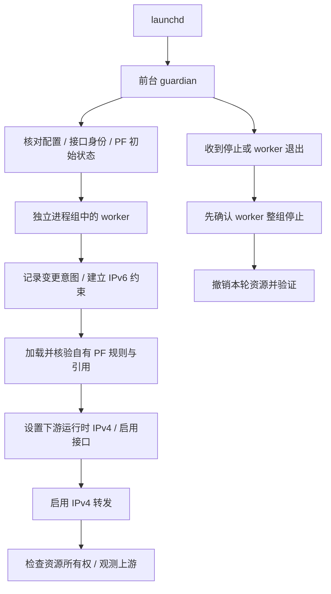

# 设计与边界

SoftRouter 将 macOS 已建立的上游 Wi-Fi 连接共享给一个下游路由器 WAN IPv4 地址。macOS 管理 Wi-Fi、DHCP、企业 802.1X 与认证凭据；下游路由器管理客户端接入、LAN 地址及其自身 NAT。

## 进程与资源顺序

guardian 在网络变更前就绪。worker 拥有独立进程组，正常退出时保留可识别的组长，由 guardian 停止整组后进行清理，避免仍在执行的配置命令与回滚并发。无法确认进程组已经停止时，保留恢复信息并报告 `ATTENTION`。

变更意图先于相应操作落盘，用于覆盖操作完成但完成标记尚未写入时的中断。配置和运行状态保存在受保护的目录，不从用户可写日志中恢复特权指令。

## PF 转发边界

上游 DHCP 可能将 OFFER/ACK 单播到尚未分配给本机的地址。规则专门允许上游接口 UDP 67 到 68 的无状态接收，并给该类包独立标签，禁止继续从任意接口输出。该保护在正常规则及清理期间保留的保护规则中均存在，不能用静态本机地址匹配代替。

下游指定来源先获得内部标记，再经过正常系统路由选择。只有从上游接口输出、且源地址已转换为该接口地址的标记包可以建立连接状态。状态绑定上游接口，返程按保留的标记回到下游；其他出口上的标记包被丢弃。

本机接收地址与广播例外使用动态接口地址，避免启动时没有上游地址导致后续本机回包被拦截，也避免已经移除的旧本机地址继续成为转发例外。它们基于启动时识别的接口集合；这不是任意接口热插拔管理器。

系统默认路由仍由 macOS 决定。项目不添加默认路由，也不使用 PF 的强制路由功能。上游接口切换 SSID 后仍是同一个允许出口；PF 不负责验证校园或企业网络身份。

## 上游健康与所有权分开处理

SSID、上游 IPv4 与默认路由变化仅记录诊断，不导致退出、不关闭转发，也不因暂时断网主动清除连接状态。缺少可用路径时，网络请求自然失败；路径恢复后，客户端可重新建立连接。

资源所有权检查仍然严格。PF 规则、引用、下游服务身份、地址或全局转发状态被其他程序改变时，可以触发停止与受限清理。IPv4 转发是系统全局开关，PF 自有引用并不等于独占该开关；因此本项目要求空闲初始状态，不承诺与互联网共享、VPN 或其他 PF 管理程序同时工作。

## IPv6 基线

本项目不转发 IPv6，也不主动附加 IPv6 协议。已有 ND6 状态时，只设置并读回验证接口的 IPv6 禁用标志。接口没有 IPv6 地址且只读 ND6 查询明确表示未初始化时，保留该状态。

仅凭 `ifconfig` 没有显示 ND6 信息不足以判断未初始化，因为标志值为零时也可能没有该行。清理只恢复本轮改变的标志，并重新核对保存的模式；不通过附加协议来满足检查。

## 停止、重启与异常恢复

正常清理先停止 worker，再在所有权可以确认时关闭本轮 IPv4 转发、删除指定客户端状态、清空自有规则锚、释放自有 PF 引用，并撤销下游运行时地址和接口状态。项目不执行全局 PF 清空，也不改写上游网络偏好。

如果全局转发或规则所有权发生变化，清理可能保留保护性规则与引用，并返回 `ATTENTION`。此时日志描述的是需要检查的状态，不能将停止服务等同于完整回滚。

同一启动会话中的遗留状态不被新实例自动接管；PID 数字本身不能证明进程仍归本项目所有。系统启动标识变化后，可以归档旧证据，但仍须重新通过完整预检。launchd 的重新启动不能替代这些所有权检查。

本项目不能保持睡眠中的 Mac 转发数据。接口重命名、换网卡、系统更新以及认证策略变化可能要求重新核对配置。此前专用实验中出现过内核崩溃，后续标准 NAT 联网成功并未证明这一限制已消除；用户态 guardian 无法在内核崩溃时执行清理。
